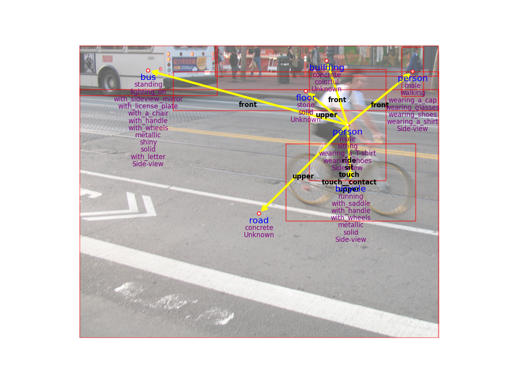
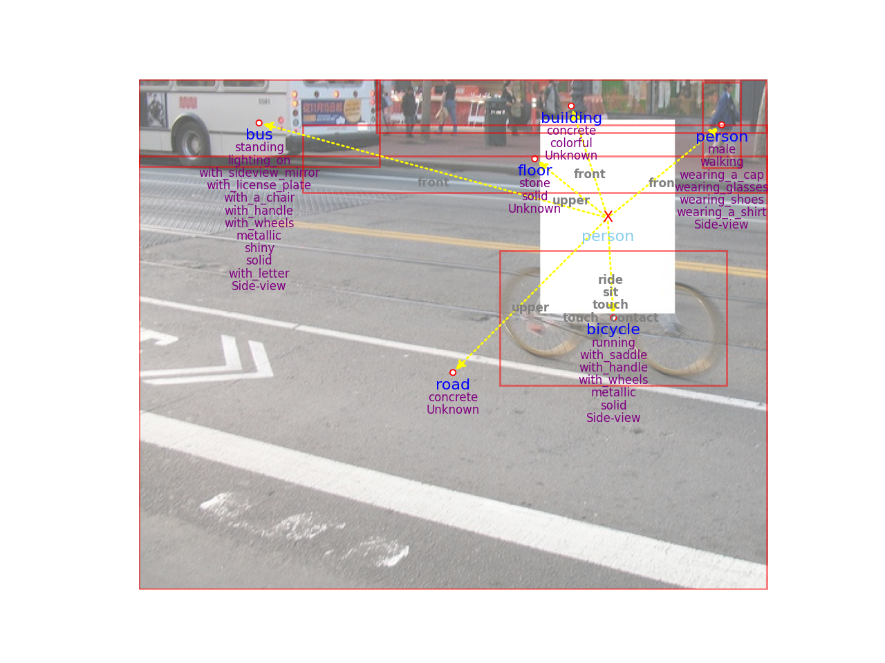
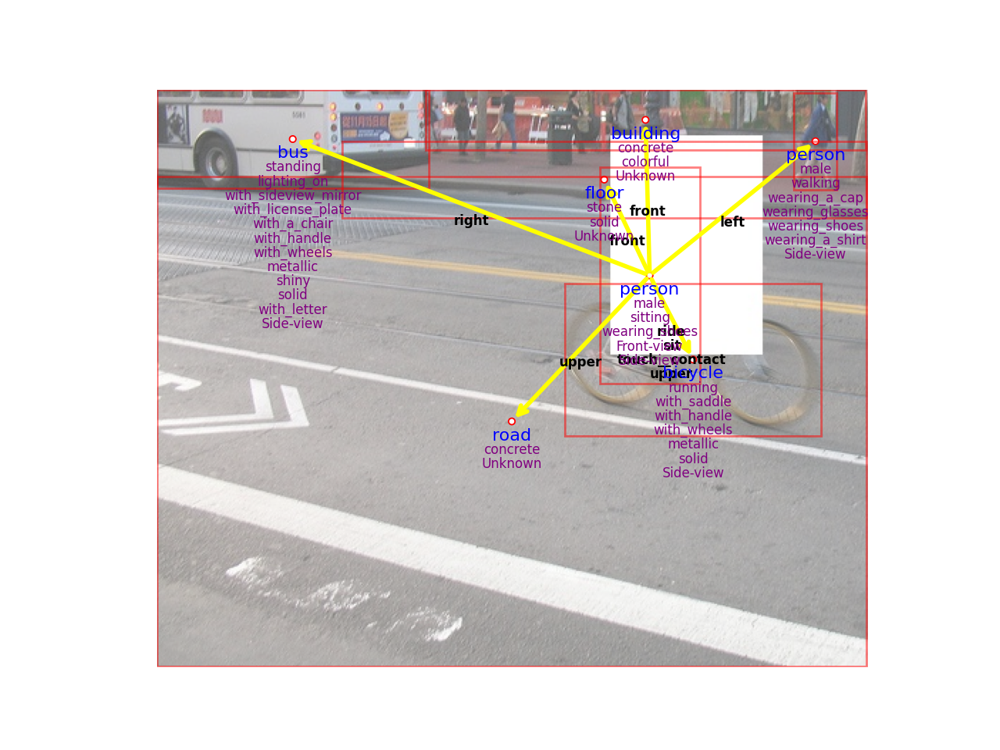
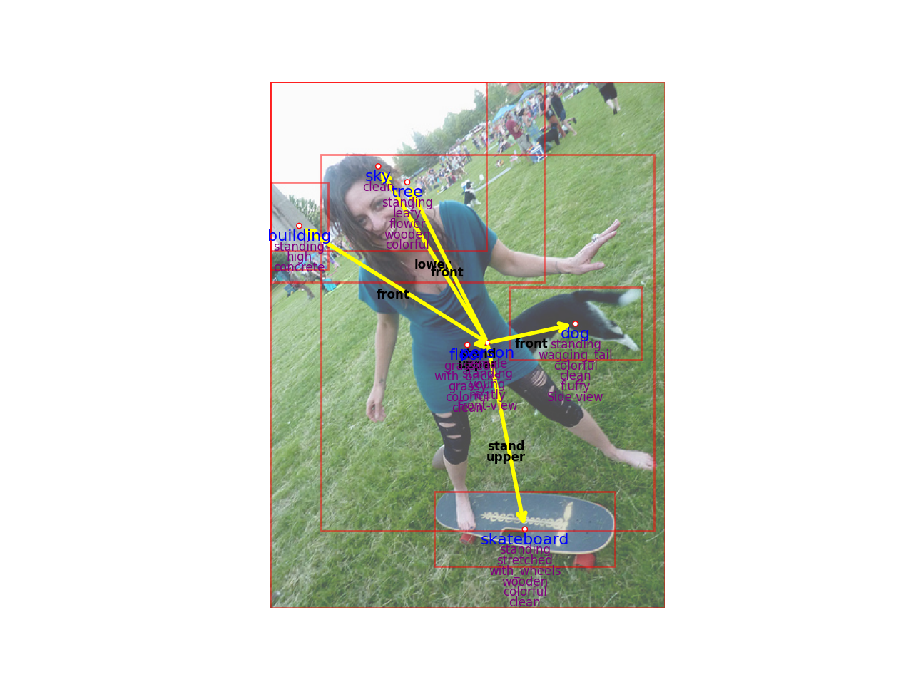
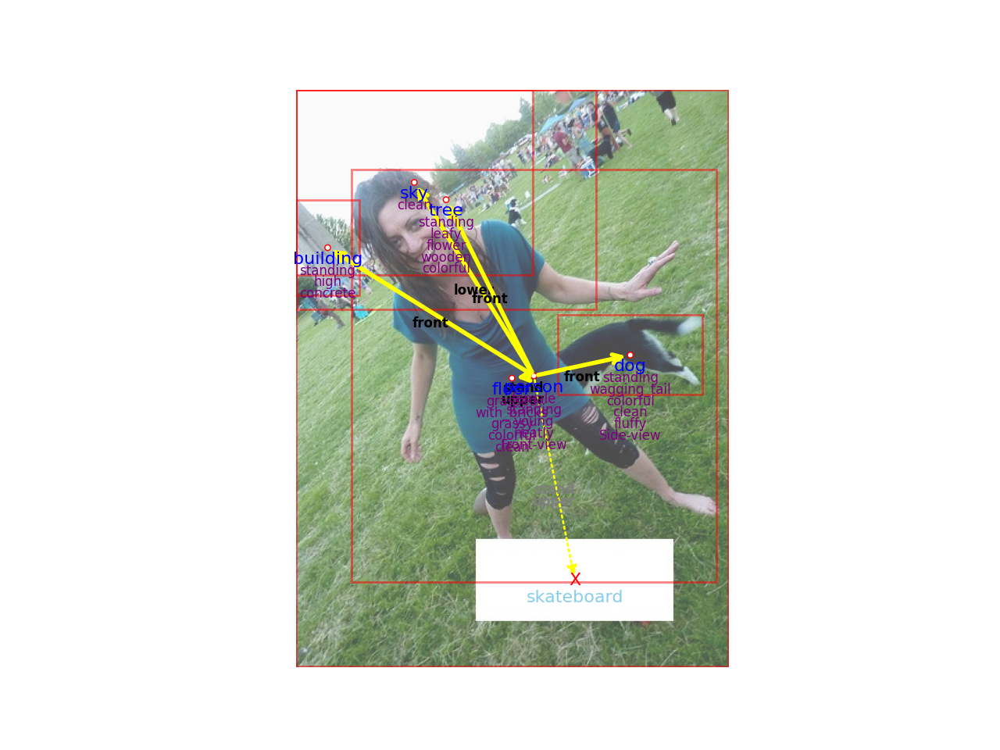
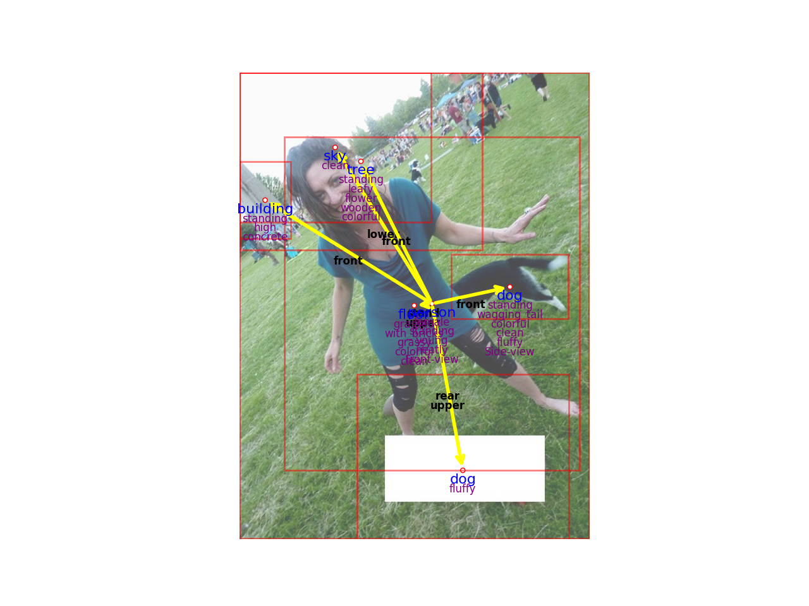

# 시각상식 과제 공개 소프트웨어 (KAIST)

## 개요

- 그래프 생성모델 학습/추론 소프트웨어 (SW) (1차년도): `./software/hot`

- 그래프 생성모델 기술 동향 분석서 (기술문서) (1차년도): `./report/hot/report.pdf`

- 그래프 인페인팅 모델 학습/추론 소프트웨어 (SW) (2차년도): `./software/inpainting`

- 그래프 인페인팅 모델 성능 분석서 (기술문서) (2차년도): `./report/inpainting/report.pdf` (참고자료: `./report/inpainting/examples`, `./report/inpainting/images`)

- 계층적 그래프 복원모델 학습 / 추론 소프트웨어 (SW) (3차년도): `./software/inpainting`

- 계층적 그래프 복원모델 성능 분석서 (기술문서) (3차년도): `./report/inpainting/report.pdf` (참고자료: `./report/inpainting/examples`, `./report/inpainting/images`)

\* 그래프 인페인팅 모델 (2차년도) 와 계층적 그래프 복원모델 (3차년도) 은 단일 모델로 통합되어 개발되었습니다.

## 예시

예시 1-1. 원본 이미지 및 장면 그래프

예시 1-2. 정점과 간선이 누락된 장면 그래프

예시 1-3. 그래프 인페인팅 결과

예시 2-1. 원본 이미지 및 장면 그래프

예시 2-2. 정점과 간선이 누락된 장면 그래프

예시 2-3. 그래프 인페인팅 결과

## Acknowledgements

The development of this open-sourced code was supported in part by Institute of Information and communications Technology Planning and evaluation (IITP) grant funded by the Korea government (MSIT) (2021-0-00537, Visual common sense through self-supervised learning for restoration of invisible parts in images).
